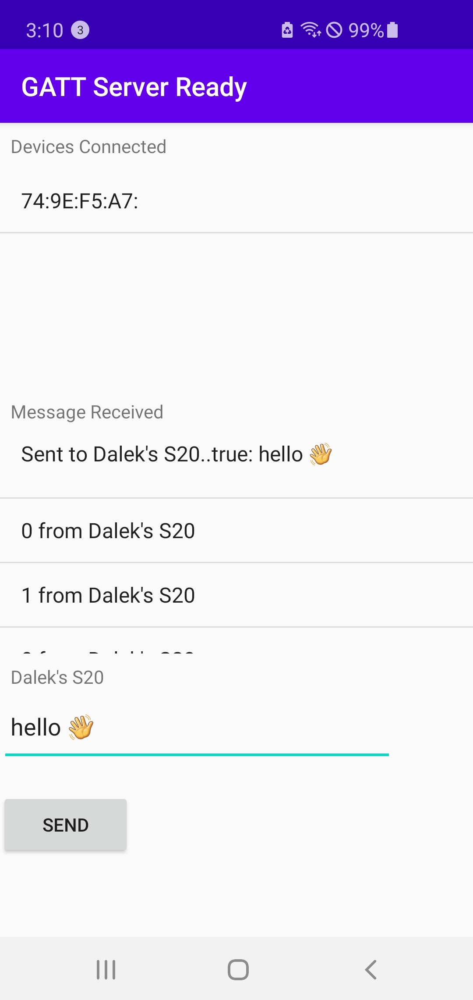

# Introduction

## BLEPeripherial
Android Gatt Server : 기다리고 있다가 외부에서 접속이 들어오면 허용하고 주고받는 App

```
6E400001-B5A3-F393-E0A9-E50E24DCCA9E for the Service
6E400002-B5A3-F393-E0A9-E50E24DCCA9E for the RX Characteristic (Property = Notify)
6E400003-B5A3-F393-E0A9-E50E24DCCA9E for the TX Characteristic (Property = Write without response)
```


## Test software
### nRF Connect for Mobile 
See  https://www.nordicsemi.com/Software-and-tools/Development-Tools/nRF-Connect-for-mobile


Last Update: November 8th, 2020
